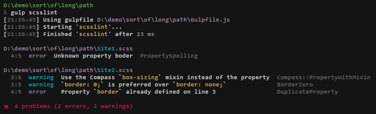
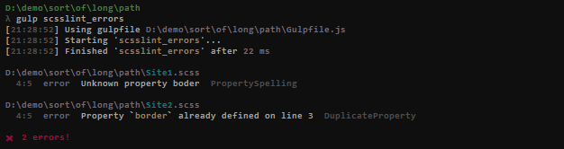
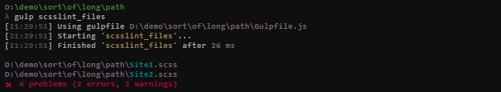
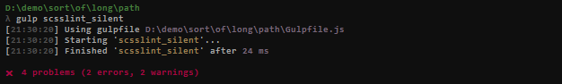

Stylish reporter for gulp-scss-lint, following the visual style of ESLint stylish reporter

[](https://david-dm.org/jsek/gulp-scss-lint-stylish2) 
[](https://github.com/jsek/gulp-scss-lint-stylish2/blob/master/LICENSE)
[](https://npmjs.org/package/gulp-scss-lint-stylish2) 
[](https://npmjs.org/package/gulp-scss-lint-stylish2) 

* [Overview](#overview)
* [Installation](#installation)
* [Usage](#usage)

## Overview

Example console output:



## Installation

```
npm install --save gulp-scss-lint-stylish2
```

## Usage

``` javascript
var gulp     = require('gulp'),
    scssLint = require('gulp-scss-lint'),
    stylish  = require('gulp-scss-lint-stylish2');
 
gulp.task('scss-lint', function()
{
    var reporter = stylish();

    gulp.src('/scss/*.scss')
        .pipe( scssLint({ customReport: reporter.issues }) )
        .pipe( reporter.printSummary );
});
```

Use `errorsOnly` parameter to filter out warnings:

``` javascript
    var reporter = stylish({ errorsOnly: true });
```



You can list just the files:

``` javascript
        .pipe( scssLint({ customReport: reporter.files }) )
        .pipe( reporter.printSummary );
```



... or suppress output and print just the summary:

``` javascript
        .pipe( scssLint({ customReport: reporter.silent }) )
        .pipe( reporter.printSummary );
```

